# Humain-AI-Recrutement - Frontend

Ce répertoire contient le code source de la partie frontend de l'application Humain-AI-Recrutement.

## Description

Notre projet de développement concerne une application web novatrice pour le recrutement, basée sur un système de matching par valeurs. L'objectif principal de cette application est de simplifier et d'optimiser le processus de recrutement, en tenant compte des valeurs personnelles des candidats et des recruteurs.

## Technologies utilisées

- Angular

## Fonctionnalités

L'application offre les fonctionnalités suivantes :

- Inscription et gestion des comptes utilisateurs
- Recherche d'offres d'emploi
- Publication d'offres d'emploi
- Soumission de candidatures
- Gestion des candidatures
- Gestion des entretiens

## Interfaces

L'application propose les interfaces suivantes :

- Page d'accueil pour employeur

  
  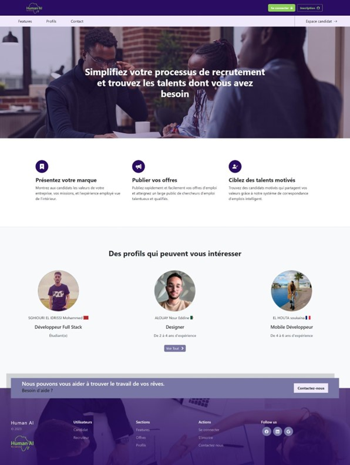
- Page d'accueil pour candidat

  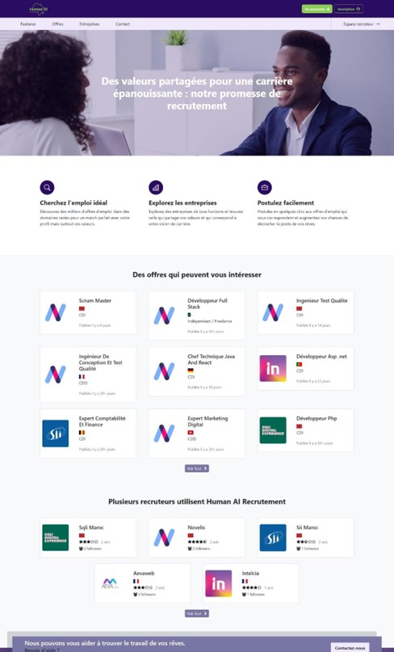
- Page d'inscription

  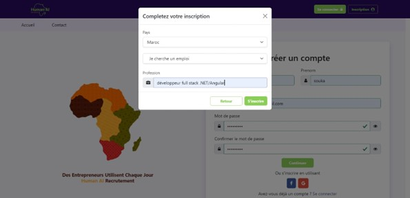
- Page de connexion

  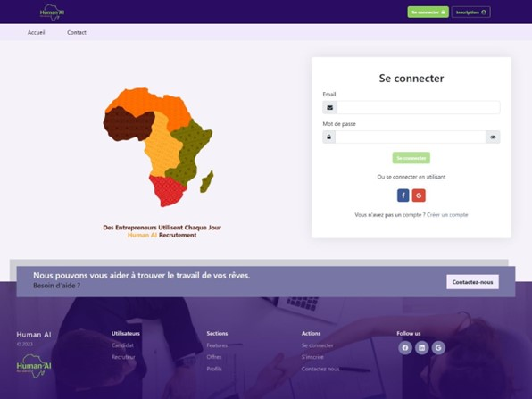
- Page de contact du support

  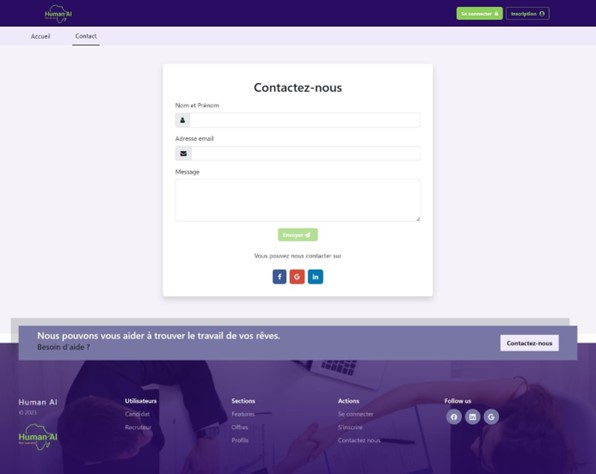
- Page de création de profil candidat

  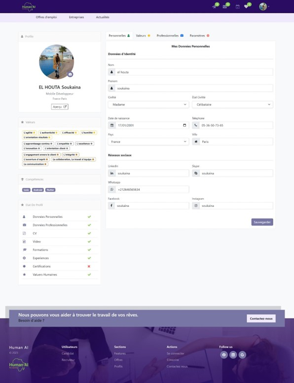

  

  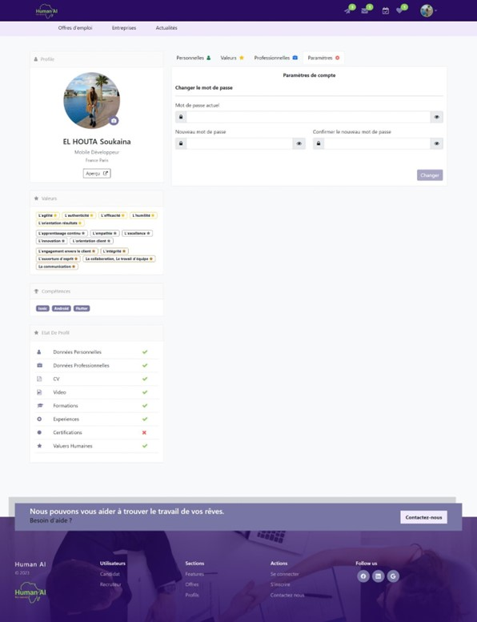
- Page présentant les offres

  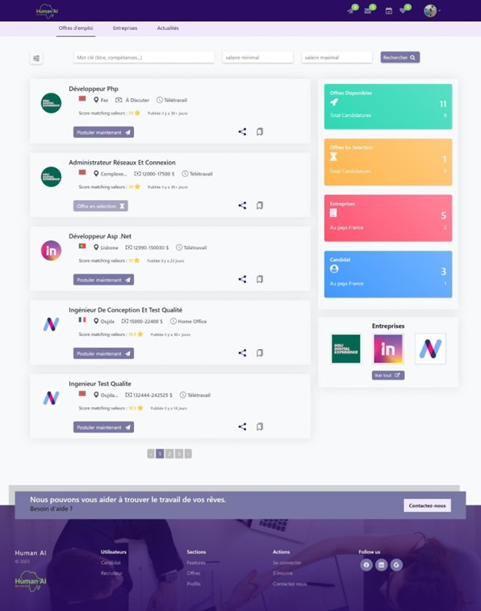
- Page détail de l'offre

  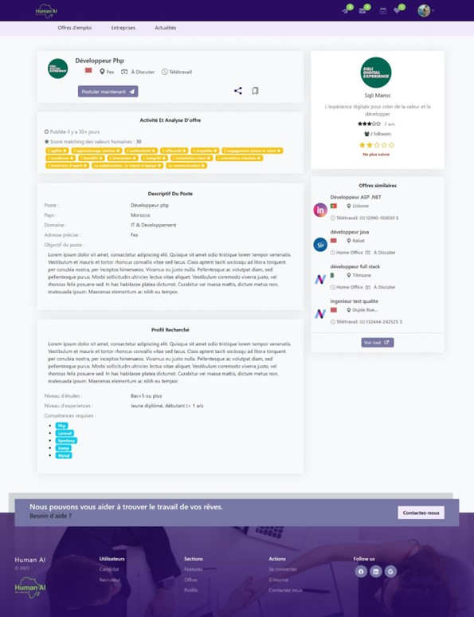
- Page des entreprises

  
- Page des candidatures d'un candidat

  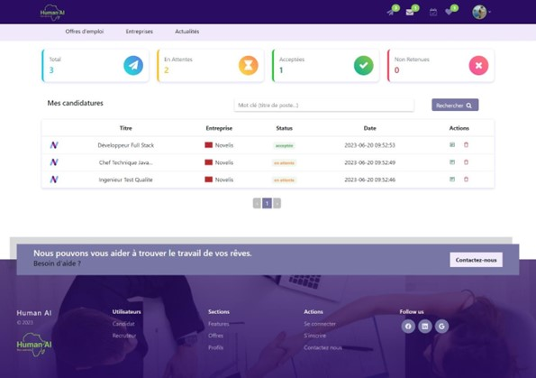
- Page des enregistrements

  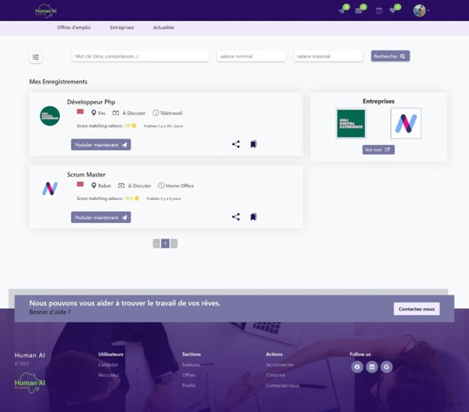
- Page de création de profil entreprise

  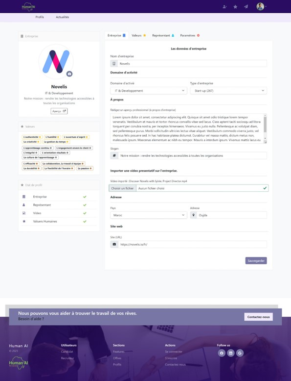

  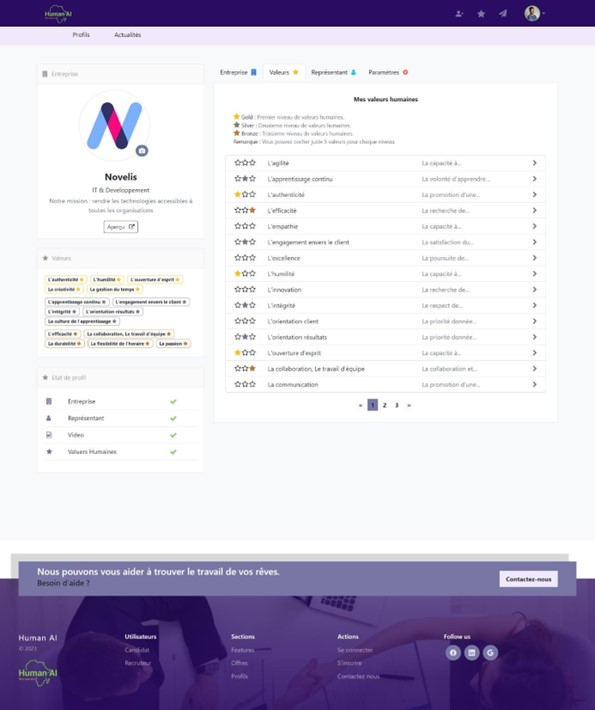

  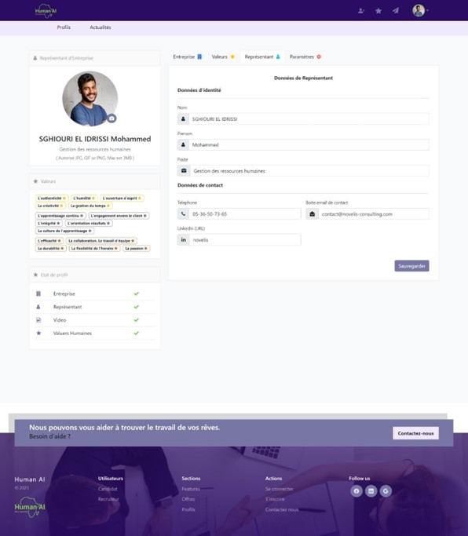

  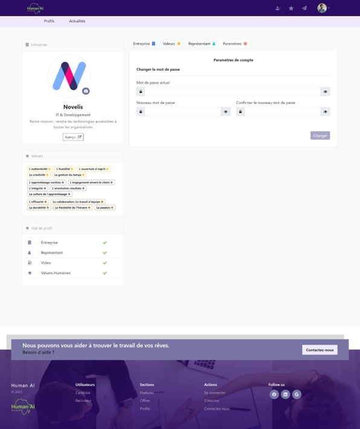
- Page des profils candidat

  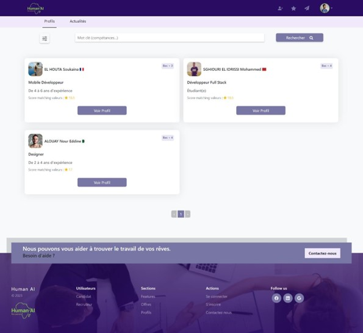

  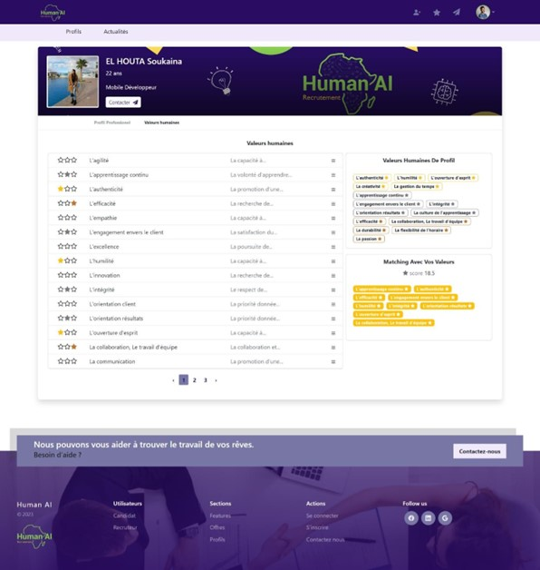
- Page des offres de l'entreprise

  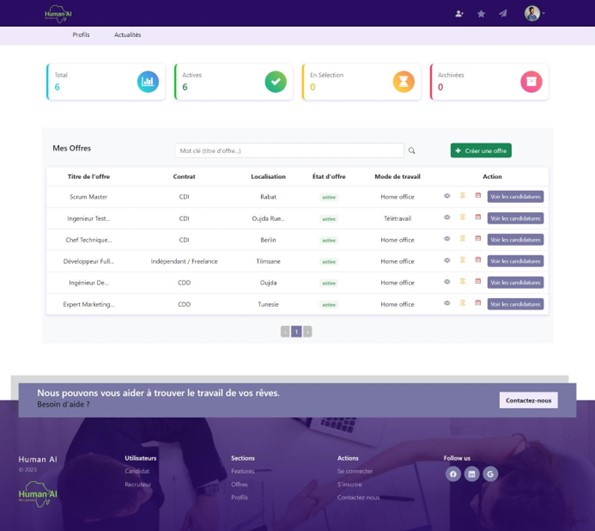
- Page de visualisation des candidatures pour une offre

  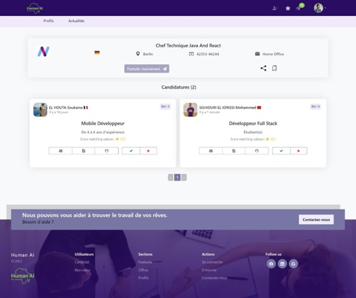
- Page du profil d'un candidat

  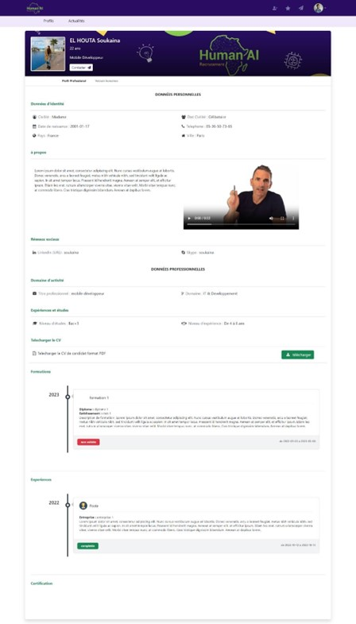

  
- Page d'ajout d'une offre

  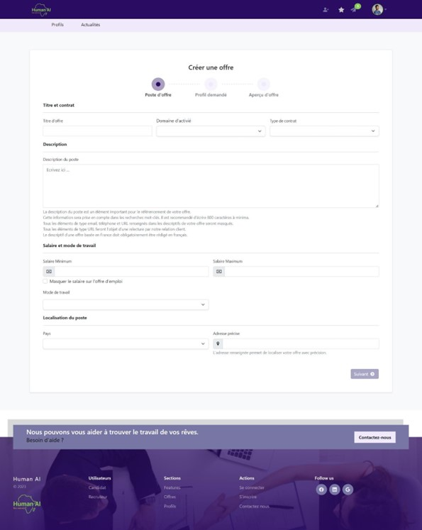

  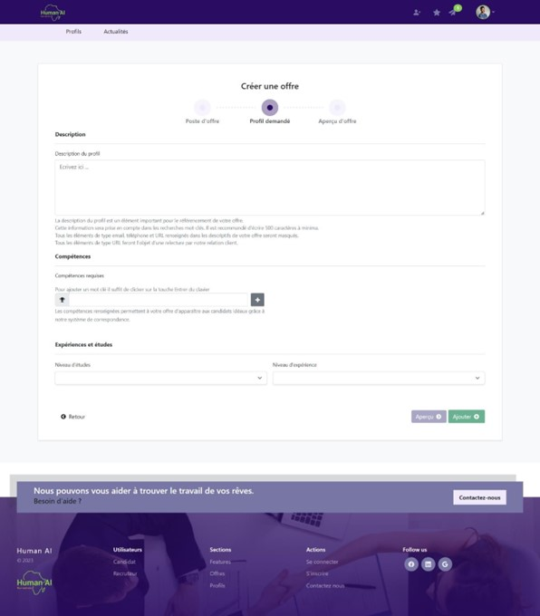

  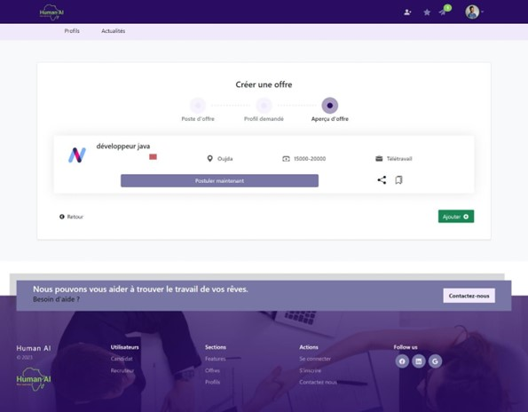

## Installation

Pour mettre en place l'environnement de projet Angular, suivez les étapes suivantes :

1. Ouvrez votre terminal et accédez au répertoire dans lequel vous souhaitez cloner le projet.
2. Clonez le référentiel GitHub en utilisant la commande suivante :
git clone https://github.com/IdrissiSM/Humain-AI-Recrutement.git
3. Accédez au répertoire du projet cloné :
cd Humain-AI-Recrutement
4. Installez les dépendances du projet en exécutant la commande suivante :
npm install
Cela téléchargera et installera toutes les dépendances nécessaires répertoriées dans le fichier `package.json`.

## Exécution

Une fois l'installation terminée, vous pouvez lancer le projet Angular en mode développement en utilisant la commande suivante :
ng serve

L'application sera accessible à l'adresse `http://localhost:4200/` dans votre navigateur.

## Dépendances

Les principales dépendances utilisées dans ce projet sont répertoriées dans le fichier `package.json`. Voici quelques-unes d'entre elles :

- "@angular/animations": "^15.2.0"
- "@angular/cdk": "^15.2.8"
- "@angular/common": "^15.2.0"
- "@angular/compiler": "^15.2.0"
- "@angular/core": "^15.2.0"
- "@angular/forms": "^15.2.0"
- "@angular/material": "^15.2.8"
- "rxjs": "~7.8.0"
- "zone.js": "~0.12.0"

Consultez le fichier `package.json` pour la liste complète des dépendances.

## Contributeurs

- [Nom du contributeur 1](lien/vers/profil1)
- [Nom du contributeur 2](lien/vers/profil2)
- [Nom du contributeur 3](lien/vers/profil3)

N'hésitez pas à consulter les profils des contributeurs pour plus d'informations.

## Licence

Ce projet est sous licence [Nom de la licence](lien/vers/licence). Consultez le fichier `LICENSE` pour plus de détails.
